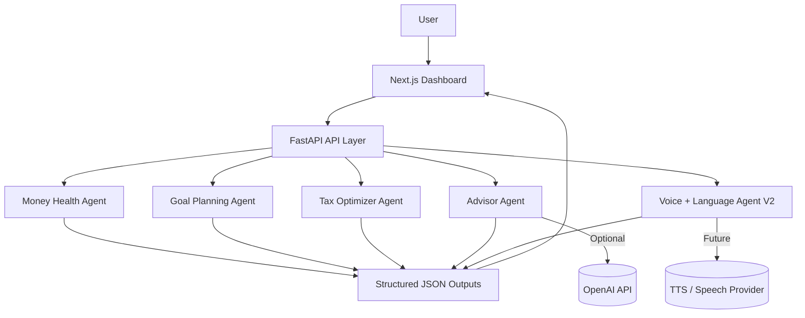
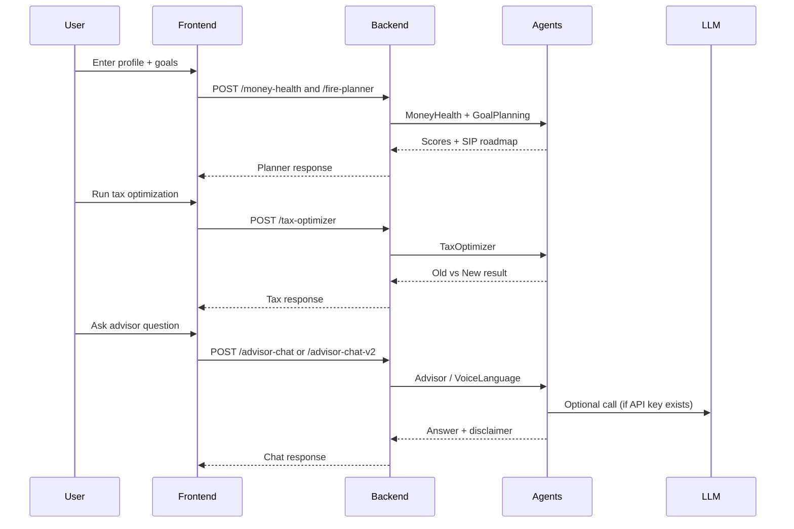
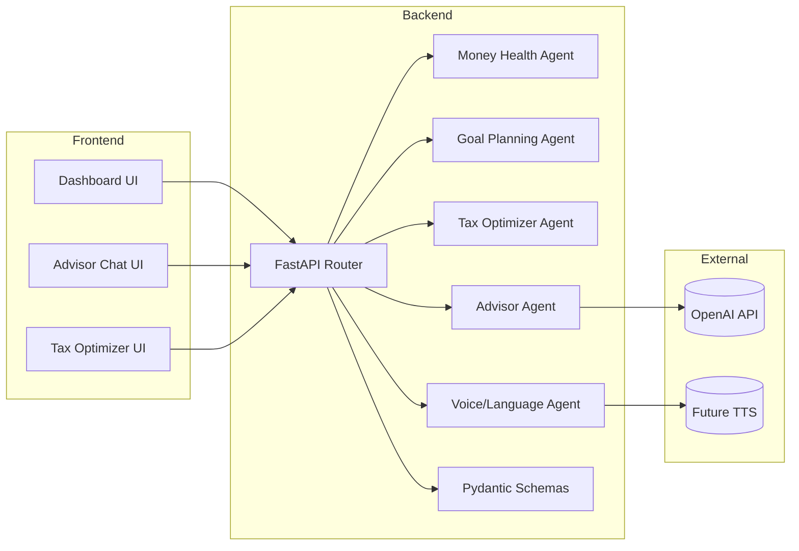
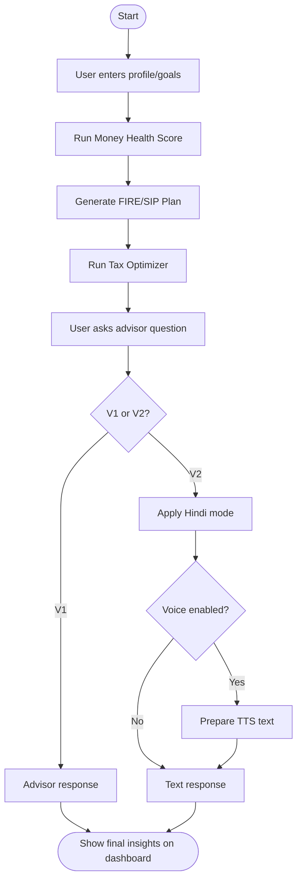
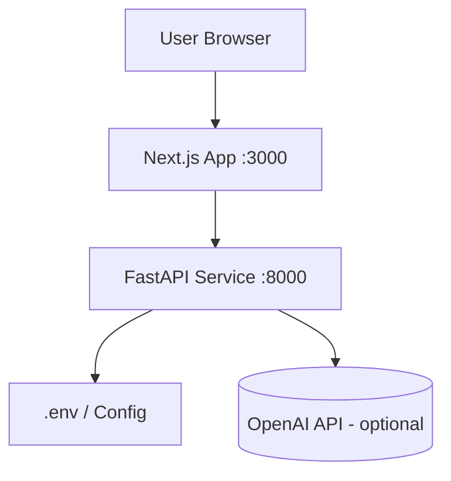

# FinGuru AI - Your Personal Money Mentor

FinGuru AI is an India-focused full-stack project that helps users plan money, optimize taxes, and invest with confidence using a practical AI-assisted workflow.

## Problem Statement

95% of Indians do not have a formal financial plan. Traditional advisory can cost INR 25,000+ annually and is often inaccessible for mass-market users.

FinGuru AI makes financial planning simple, personalized, and affordable.

## Why This Matters

- Financial confusion delays investing and increases tax leakage.
- Most users need actionable monthly guidance, not generic blogs.
- A chat-first, dashboard-first experience improves adoption for beginners.

## What We Built

### Core Features (Hackathon Critical)

1. Money Health Score (0-100)
- Evaluates six dimensions: emergency preparedness, insurance coverage, diversification, debt health, tax efficiency, and retirement readiness.

2. FIRE / SIP Planner
- Generates goal-wise monthly SIP recommendations.
- Suggests risk-based asset allocation.
- Estimates emergency fund target and insurance gap.

3. Tax Optimizer
- Compares old vs new tax regime.
- Recommends better regime and estimated tax savings.

4. AI Financial Advisor Chat
- Accepts free-text user questions.
- Uses OpenAI when key is configured.
- Supports deterministic fallback for offline/demo mode.

### Bonus (Phase-2 Scaffold)

5. Hindi + Voice Support
- New Advisor V2 endpoint with `language` and `voice_enabled` fields.
- Ready integration point for production translation and TTS provider.

## User Journey

1. User enters profile and goals.
2. Platform calculates Money Health Score.
3. Platform generates FIRE plan with SIP roadmap.
4. User compares tax regimes and sees savings opportunity.
5. User asks follow-up questions through AI advisor.
6. Optional Hindi + voice mode used in Advisor V2.

## USP (Winning Edge)

- Multi-agent architecture with practical finance modules.
- India-focused planning and tax context.
- Beginner-friendly dashboard and explainable outputs.
- Easy extension path for Hindi + voice-first experiences.

## Real-World Personas

- Students: first savings and emergency planning.
- Salaried professionals: tax optimization + SIP discipline.
- New investors: risk-aware allocation guidance.
- Couples/families (future scope): joint planning and net-worth view.

## System Architecture



### Request Flow (End-to-End)



Detailed architecture document: [docs/ARCHITECTURE.md](docs/ARCHITECTURE.md)

## Agent Design

| Agent | Responsibility | Output |
|------|----------------|--------|
| Money Health Agent | Financial wellness scoring across 6 dimensions | Score + insights + recommendations |
| Goal Planning Agent | FIRE roadmap and goal-wise SIP planning | SIP values + allocation + milestones |
| Tax Optimizer Agent | Tax regime comparison and deduction guidance | Best regime + tax_saved + suggestions |
| Advisor Agent | Conversational financial guidance | Answer + disclaimer |
| Voice Language Agent (V2) | Hindi mode and voice-ready output scaffold | answer_text + tts_text + provider hint |

## Tech Stack

### Frontend
- Next.js (React)
- Responsive dashboard UI

### Backend
- FastAPI
- Pydantic schemas and validation
- Modular multi-agent structure

### AI Integration
- OpenAI (optional)
- Fallback mode for deterministic demo outputs

## Project Structure

```text
FinGuru-AI-Your-Personal-Money-Mentor/
|- backend/
|  |- app/
|  |  |- agents/
|  |  |- models/
|  |  |- routes/
|  |  |- config.py
|  |  |- main.py
|  |- requirements.txt
|- frontend/
|  |- components/
|  |- pages/
|  |- styles/
|- docs/
|  |- ARCHITECTURE.md
|  |- impact-model.md
|  |- pitch-video-script.md
|- README.md
```

## API Endpoints

- POST /api/v1/finance/money-health
- POST /api/v1/finance/fire-planner
- POST /api/v1/finance/tax-optimizer
- POST /api/v1/finance/advisor-chat
- POST /api/v1/finance/advisor-chat-v2 (Phase-2)

## API Samples (Payload + Response)

### 1) Money Health Score

Request:

```json
{
  "age": 27,
  "monthly_income": 80000,
  "monthly_expenses": 42000,
  "monthly_emi": 8000,
  "existing_investments": 250000,
  "emergency_fund": 100000,
  "annual_insurance_cover": 600000,
  "annual_salary": 960000,
  "risk_appetite": "balanced",
  "goals": [
    {
      "name": "Retirement Corpus",
      "target_amount": 30000000,
      "years_to_goal": 25,
      "priority": "high"
    }
  ]
}
```

Response (sample):

```json
{
  "total_score": 58,
  "status": "Stable but needs improvement",
  "dimensions": [
    {
      "name": "Emergency Preparedness",
      "score": 40,
      "insight": "Emergency fund covers 2.4 months."
    }
  ],
  "recommendations": [
    "Build emergency corpus to 6 months of expenses."
  ]
}
```

### 2) FIRE Planner

Request:

```json
{
  "age": 27,
  "monthly_income": 80000,
  "monthly_expenses": 42000,
  "monthly_emi": 8000,
  "existing_investments": 250000,
  "emergency_fund": 100000,
  "annual_insurance_cover": 600000,
  "annual_salary": 960000,
  "risk_appetite": "balanced",
  "goals": [
    {
      "name": "Retirement Corpus",
      "target_amount": 30000000,
      "years_to_goal": 25,
      "priority": "high"
    },
    {
      "name": "House Down Payment",
      "target_amount": 3000000,
      "years_to_goal": 7,
      "priority": "medium"
    }
  ]
}
```

Response (sample):

```json
{
  "total_monthly_sip": 29152.4,
  "asset_allocation": {
    "equity": 55,
    "debt": 30,
    "gold": 10,
    "cash": 5
  },
  "emergency_fund_target": 252000,
  "insurance_gap": 13800000,
  "monthly_roadmap": [
    "Month 1-2: Build emergency fund and complete insurance coverage."
  ],
  "goals": [
    {
      "goal_name": "Retirement Corpus",
      "monthly_sip": 14700.2,
      "expected_corpus": 30000000,
      "years_to_goal": 25
    }
  ]
}
```

### 3) Tax Optimizer

Request:

```json
{
  "annual_salary": 960000,
  "section_80c": 150000,
  "section_80d": 25000,
  "hra_exemption": 120000,
  "home_loan_interest": 0,
  "other_deductions": 0
}
```

Response (sample):

```json
{
  "old_regime": {
    "taxable_income": 665000,
    "tax_before_cess": 45500,
    "cess": 1820,
    "total_tax": 47320
  },
  "new_regime": {
    "taxable_income": 885000,
    "tax_before_cess": 44250,
    "cess": 1770,
    "total_tax": 46020
  },
  "better_regime": "new",
  "tax_saved": 1300,
  "suggestions": [
    "Max out 80C via EPF, ELSS, PPF, or life insurance premium."
  ]
}
```

### 4) Advisor Chat V2 (Hindi + Voice Scaffold)

Request:

```json
{
  "question": "Mujhe FIRE ke liye monthly SIP kitna rakhna chahiye?",
  "language": "hi",
  "voice_enabled": true
}
```

Response (sample):

```json
{
  "answer_text": "Hindi Mode: Start with a SIP equal to at least 20% of your monthly income and increase it 10% yearly.",
  "language": "hi",
  "tts_text": "Hindi Mode: Start with a SIP equal to at least 20% of your monthly income and increase it 10% yearly.",
  "tts_provider_hint": "Integrate Azure Speech or gTTS in production",
  "disclaimer": "Educational guidance only. This is not a SEBI-registered investment advisory service."
}
```

## Installation and Setup

### Backend

```bash
cd backend
python -m venv .venv
.venv\Scripts\activate
pip install -r requirements.txt
copy .env.example .env
uvicorn app.main:app --reload
```

Backend URL: http://127.0.0.1:8000

### Frontend

```bash
cd frontend
npm install
```

Create `.env.local`:

```bash
NEXT_PUBLIC_API_BASE=http://127.0.0.1:8000/api/v1
```

Run:

```bash
npm run dev
```

Frontend URL: http://localhost:3000

## Demo Script (3 Minutes)

Pitch script and demo sequence: [docs/pitch-video-script.md](docs/pitch-video-script.md)

## Submission Criteria Mapping

1. Public GitHub Repository
- Source code, setup steps, and documentation are included in this repository.

2. 3-Minute Pitch Video
- Ready script and demo flow provided in docs.

3. Architecture Document
- Detailed architecture is provided in [docs/ARCHITECTURE.md](docs/ARCHITECTURE.md).

4. Impact Model
- Quantified impact assumptions and calculations are provided in [docs/impact-model.md](docs/impact-model.md).

## Impact Snapshot

Example estimate for 1,000 active users:
- Tax optimization impact: INR 50,00,000
- Advisory cost avoided: INR 2,00,00,000
- Time value recovered: INR 30,00,000
- Total estimated annual impact: INR 2,80,00,000

## Future Roadmap

- Upload Form 16 and salary slip parsing.
- CAMS/KFintech portfolio X-ray.
- Couple money planner and joint optimization.
- Life-event advisor for bonus/marriage/new baby.
- Production-grade Hindi translation and TTS audio generation.

## Disclaimer

FinGuru AI is for educational guidance and planning support only.

## Detailed Tech Stack and Library Usage (Import-Level)

This section maps actual project dependencies/imports to their purpose in this codebase.

### Backend Libraries (Python)

| Library | Where Used | Why It Is Used |
|---------|------------|----------------|
| fastapi | `backend/app/main.py`, `backend/app/routes/finance_routes.py` | API framework for creating finance endpoints and request handling |
| uvicorn | backend runtime command | ASGI server to run FastAPI app in development/production |
| pydantic | `backend/app/models/schemas.py` | Input/output schema validation for all APIs |
| pydantic-settings | `backend/app/config.py` | Environment-driven configuration management (`.env` support) |
| python-dotenv | environment loading via settings flow | Reads environment variables from `.env` file |
| openai | `backend/app/agents/advisor_agent.py` | LLM-based advisory responses when API key is configured |

### Frontend Libraries (JavaScript)

| Library | Where Used | Why It Is Used |
|---------|------------|----------------|
| next | `frontend/pages/*` + Next runtime | Frontend framework, routing, build optimization |
| react | `frontend/pages/index.js` | UI state management and component rendering |
| react-dom | Next.js runtime dependency | Browser DOM rendering layer for React |

### Python Standard Library Imports Used

| Module | Where Used | Purpose |
|--------|------------|---------|
| __future__.annotations | agent/model files | Forward-reference typing support |
| typing | schema and utility files | Type hints (`Literal`, `Dict`, `List`) |
| os | agent logic | Environment/helper utilities |
| json | agent parsing helper | JSON parsing/serialization utility |

### Internal Modules Used

| Module | Purpose |
|--------|---------|
| `app.agents.money_health_agent` | Computes 6-dimension health score |
| `app.agents.goal_planning_agent` | FIRE roadmap and SIP calculation |
| `app.agents.tax_optimizer_agent` | Tax regime comparison and recommendations |
| `app.agents.advisor_agent` | LLM/fallback conversational advisor |
| `app.agents.voice_language_agent` | Hindi/voice response scaffold (V2) |
| `app.models.schemas` | Strong request/response contracts |
| `app.routes.finance_routes` | Exposes all finance APIs |
| `app.config` | App settings and environment config |

## Architecture Deep Dive (Additional Diagrams)

### 1) Component Architecture



### 2) Functional Flowchart



### 3) Deployment/Runtime View



## Workflow (Execution Logic)

1. Validation Layer
- Every request first passes through Pydantic schemas.

2. Routing Layer
- Finance routes dispatch task-specific payloads to corresponding agents.

3. Agent Computation Layer
- Deterministic formulas for money health, SIP planning, and tax comparison.
- LLM-backed advisor path for conversational guidance.

4. Response Layer
- Structured JSON outputs are returned to frontend and rendered into cards, tables, and chat output.

5. Phase-2 Multimodal Layer
- Advisor V2 adds language selection and voice-ready response formatting.

## Traceability: Feature to Endpoint to Agent

| Feature | Endpoint | Backend Agent |
|---------|----------|---------------|
| Money Health Score | `/api/v1/finance/money-health` | `evaluate_money_health` |
| FIRE Planner | `/api/v1/finance/fire-planner` | `build_fire_roadmap` |
| Tax Optimizer | `/api/v1/finance/tax-optimizer` | `compare_tax_regimes` |
| Advisor Chat V1 | `/api/v1/finance/advisor-chat` | `answer_financial_query` |
| Advisor Chat V2 | `/api/v1/finance/advisor-chat-v2` | `answer_query_with_language_voice` |
